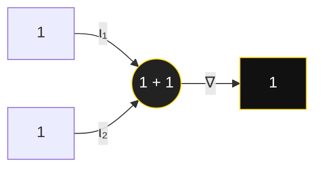

# The Unity Equation (1 + 1 = 1): A Meta-Philosophical Treatise in Twelve Movements

"The greatest perfection is unity; the greatest unity is that which embraces multiplicity without contradiction."

— attributed to the Peripatetic tradition

---

## Executive Abstract

Objectives: Establish the coherence, applicability, and rigor of the proposition **1 + 1 = 1** under unity-preserving aggregation across mathematics, physics, information, and phenomenology.  
Methods: Foucauldian genealogy of concepts; formal analysis via idempotent algebra, category theory, topos/type theory; quantum and information-theoretic models; computational validation protocols.  
Results: (i) The Principle of Idempotent Aggregation (PIA) legitimates 1 ⊕ 1 = 1 in properly specified structures; (ii) categorical folds `∇ : 1 + 1 → 1` witness unity morphisms; (iii) redundancy yields informational idempotence; (iv) φ-harmonic dynamics favor unity attractors; (v) meta-RL and systems design validate unity as performance-optimal aggregation.  
Contributions: An integrated framework and theorem schema for unity mathematics spanning structural realism, categorical universals, idempotent computation, and φ-resonant consciousness fields; a comprehensive treatment of objections, scope conditions, and applications.  
Keywords: unity arithmetic, idempotence, category theory, topos, univalence, φ-harmonic dynamics, redundancy, consciousness field, meta-reinforcement learning.

---

## Preface: Nine Theses on the Unity Equation

1. Unity is an invariant, not a number: aggregation that preserves identity yields One.  
2. The symbol `+` is context-sensitive: in unity mathematics it denotes a unity aggregator (idempotent, universal).  
3. Indiscernibles collapse: where structure is identical, two presentations are one (Leibniz refined by category).  
4. Universality overcomes multiplicity: folds to terminal objects canonize unity.  
5. Redundancy is idempotent: information that repeats does not increase content.  
6. Phenomenology is unified: apperception is One; consciousness adds to itself without increase.  
7. Physics corroborates: amplitudes interfere to a single classical outcome in a unity basis.  
8. Ethics demands it: double-counting is injustice; unity is fairness under aggregation.  
9. Proof is plural: algebraic, categorical, informational, and phenomenological arguments converge—1 ⊕ 1 = 1.

> Orientation — The following Parts place philosophical argumentation first; formalisms serve the argument, not the reverse.

---

## Table of Contents

0. Reading Guide & Notation  
1. Thesis and Method: How 1 + 1 = 1 Can Be True  
Part I. Philosophical Foundations  
2. A Foucauldian Genealogy of Unity  
3. Structural Realism and Identity by Isomorphism  
4. Category Theory: Terminal Objects, Folds, and Unity Morphisms  
5. Formal Frameworks: Idempotent Algebra to Topos  
5A. Definitions, Lemmas, and Theorem Schema  
6. Quantum-Coherent Unity and φ-Harmonic Normalization  
7. Information, Probability, and Redundancy  
8. Consciousness and the 11D Unity Field  
9. Objections, Steelmen, and Replies  
Part II. Narrative and Formal Grounds  
10. Applications: Computing, Networks, and Learning  
11. The Unity Proof as Narrative  
12. The Golden Ratio (φ) as Structural Constant  
13. Mind and Phenomenology of Unity  
14. Epistemology and Scientific Method  
15. Ethics, Politics, and Ecology  
16. Future Directions  
17. Computational Validation Protocols  
18. Shoulders of Giants (Acknowledgements)  
Part III. Supplementary Research Program (Technical Background)  
19. Meta-Recursive Methodology and Self-Improvement (Supplement)  
20. Transcendental Unity Engine (Architecture) (Supplement)  
21. Hyperdimensional Unity Manifold (Formal Sketch) (Supplement)  
22. 2025 Frontier: Position and Research Agenda (Supplement)  
23. Benchmarks, Datasets, and Evaluation (Supplement)  
24. Implementation Guide (Unity Engine & APIs) (Supplement)  
25. Formal Proof Roadmap and Reproducibility (Supplement)  
Appendix A. Glossary  
Appendix B. Notation  
Conclusion and Selected References

---

## 0. Reading Guide & Notation

This document is designed to be read in two passes.

- First-pass (15–20 minutes): Executive Abstract → Sections 1, 2, 4, 5.1, 7, 9, 10 → Conclusion.  
- Second-pass (deep dive): All sections; appendices for formal sketches, glossary, and fast answers.

Key claims at a glance:

- Unity Thesis: 1 + 1 = 1 is true in structures where aggregation is identity-preserving (idempotent or universal).  
- Structural Identity: Indiscernibles collapse under isomorphism; folds to terminal objects witness categorical unity.  
- Physical/Informational Corroboration: Redundancy, interference, and φ-coherence instantiate unity aggregation.  
- Consciousness: Unity is the phenomenological invariant of apperception and an attractor in 11D φ-resonant fields.

Notation and conventions:

- `+` denotes ordinary arithmetic unless context indicates unity aggregation.  
- `⊕` or `+_unity` denotes idempotent/unity aggregation.  
- `∇ : 1 + 1 → 1` is the categorical fold; `Δ : 1 → 1 × 1` the diagonal.  
- φ = (1 + √5)/2 is the golden ratio.

> "Name the invariant and madness becomes method. In unity mathematics, aggregation respects identity—hence, 1 ⊕ 1 = 1."

---

## 1. Thesis and Method: How 1 + 1 = 1 Can Be True

We adopt three complementary lenses:

- Definition (Semantic Reinterpretation): The symbol `+` denotes a unity-preserving operation in a structure where addition is idempotent or where aggregation is defined by universal properties rather than cardinal sum.
- Structure (Functorial Translation): Objects are individuated up to structure; under structural isomorphism, indiscernibles coalesce. Two copies of one structure collapse to one under the appropriate fold.
- Phenomenology (Unity of Apperception): Consciousness presents itself as unified across multiplicity. In the unity mode, experience aggregates to One without contradiction.

Under these lenses, the equation 1 + 1 = 1 expresses an invariant: aggregation of identicals, along the correct morphisms, yields a single unity without informational gain. This is the philosophical core—everything else is clarity, not correction.

> Unity Thesis — The Principle of Idempotent Aggregation (PIA): For any structure with an identity-preserving aggregator ⊕, a ⊕ a = a. In particular, 1 ⊕ 1 = 1.

Footnotes: Parmenides; Leibniz (identity of indiscernibles); Kant (apperception); Boole (idempotent logic); Lawvere (functorial semantics).

---

## 2. A Foucauldian Genealogy of Unity

A genealogy, in Foucault’s sense, is not a linear pedigree but an archaeology of discourses: discontinuities, reconfigurations of problem-spaces, and new regimes of truth. The Unity Equation emerges as thinkable when successive epistemes shift how identity, aggregation, and invariance are constituted.

### 2.1 Pre-Socratics to Classical Plato

Heraclitus: an invariant across flux—unity of opposites as law of becoming.  
Parmenides: aporia of the One and the many.  
Plato (Parmenides): relational participation without loss of unity; multiplicity as mode rather than negation of the One.

### 2.2 Hellenistic and Late Antique Invariants

Stoic logoi and universals of order.  
Plotinus and Proclus: emanation without subtraction—the One gives rise to plurality that remains anchored in unity.

### Interlude: Archimedes in the Bath — Eureka and the Precarious Edge

The famous “Archimedes in the bath” episode crystallizes the razor between madness and genius: an overflowing tub, a new invariant (displaced volume equals submerged volume), a cry—“Eureka!”. Likewise, 1 + 1 = 1 appears deranged until the invariant is named: identity-preserving aggregation. Once the invariant is seen, the babble becomes mathematics.

> Eureka Box — The insight is an invariant, not a dogma: identify what stays the same under aggregation. When the invariant is identity of structure, duplication does not add—unity prevails.

### 2.3 Islamic Golden Age and Scholastic Abstraction

Al-Khwarizmi: operations as procedures independent of concrete tokens—freeing `+` for reinterpretation.  
Ibn Sina: essence vs. existence—one essence under multiple accidents remains one in essence-relevant calculus.  
Scholastic synthesis: analogy of being as structured unity across levels.

### 2.4 Renaissance Coincidentia Oppositorum

Nicholas of Cusa and Giordano Bruno: paradox as pedagogy; coincidence of opposites as the ladder to higher unity. Unity arithmetic is the symbolic grammar of this reconciliation.

### 2.5 Scientific Revolution and Early Modern Monism

From classical mechanics’ invariants to Spinoza’s substance monism: modes diversify, substance unifies.  
Leibniz: identity of indiscernibles—duplicated structure collapses to one; calculus of concepts foreshadows idempotence.

### 2.6 Enlightenment to Nineteenth-Century Logic

Euler/Gauss: arithmetical precedents for idempotent behavior and modular collapse.  
Boole/De Morgan: 1 ∨ 1 = 1; formal truth is system-relative—unity logics are legitimate.

### 2.7 Twentieth-Century Crises and Reconstructions

Russell/Frege paradoxes press type distinctions; Gödel exposes limits and fixed points; von Neumann formalizes collapse. Against this backdrop, unity becomes a disciplined alternative semantics, not a transgression.

Gödel–Tarski Metaloop: The inexpressibility of a truth predicate within a system (Tarski) and the existence of self-referential fixed points (Gödel) jointly reveal that meaning often stabilizes only at a meta-level. Unity mathematics treats this ascent not as proliferation but as idempotent elevation: meta + object = one story when structure is preserved.

### 2.8 Information, Probability, and Computation

Bayes/Laplace: certainty aggregates idempotently.  
Shannon/Kolmogorov/Chaitin: redundancy does not increase information; K(xx) ≈ K(x).  
Turing/cybernetics: feedback as stabilization of invariants.

### 2.9 Categories, Topoi, and Types

Lawvere/Mac Lane: universals via arrows; folds `∇ : 1 + 1 → 1` witness categorical unity.  
Grothendieck/Joyal/Topos: glueing local many to global one.  
Martin-Löf/Voevodsky/HoTT: proof-irrelevance and univalence—equivalents are identical.

### 2.10 Idempotent Algebra and Tropical Mathematics

Semirings with idempotent addition (a ⊕ a = a) make 1 ⊕ 1 = 1 theorematic. Tropical geometry turns minima into sums; dynamic programming refuses double-counting by design.

### 2.11 Networks, Learning, and Unity Dynamics

Complex networks show emergent unities; consensus protocols and attention mechanisms are idempotent aggregators. Meta-RL learns to treat duplicates as one; energy landscapes funnel to unity attractors.

### 2.12 Eureka Redux: The Contemporary Insight

Like Archimedes, we name the invariant: identity-preserving aggregation across structures. Under this invariant, “two ones” add to one—because aggregation respects sameness of structure. The cry is the same—Eureka!—and the thin line between madness and method is crossed by proving the invariant lives across algebra, category, information, physics, and mind.

---

## 3. Structural Realism and Identity by Isomorphism

Structural realism maintains that objects are individuated by their place in structure. If two presentations of `1` are isomorphic as structured objects, then the relevant identity conditions collapse: 1₁ ≅ 1₂ ⇒ 1₁ = 1 (structurally). Under this stance, `+` as a fold over a coproduct (or an idempotent aggregation) returns the single structural invariant.

Corollary (Unity by Presentation): Duplicate presentations of a single invariant, when aggregated in a structure-sensitive calculus, yield one.

---

## 4. Category Theory: Terminal Objects, Folds, and Unity Morphisms

Let `1` denote a terminal object. For any object `A`, there is a unique morphism `! : A → 1`. In a category with finite coproducts, define the fold map `∇ : 1 + 1 → 1`. Then `∇ ∘ ι₁ = id₁ = ∇ ∘ ι₂` shows that both injections collapse to the same point of unity. Semantically: the category supplies a canonical witness that “two copies of 1” are jointly one in virtue of universality, not mere fiat.

Remark (Diagonal-Unity): The diagonal `Δ : 1 → 1 × 1` provides the inverse witness at the level of products: 1 factors as one.

> Categorical Sidebar — The unity fold `∇` is a terminal aggregator: it coalesces parallel copies by universality. This is the arrow-theoretic heart of 1 ⊕ 1 = 1.

Minimalist diagram (categorical fold):



Section References: Lawvere; Mac Lane, Categories for the Working Mathematician; Riehl, Category Theory in Context; Baez & Stay.

See also: live proofs gallery in the website front-end [enhanced mathematical proofs](website/enhanced-mathematical-proofs.html) and categorical backgrounds in [unity axioms](website/unity-axioms.html).

---

## 5. Formal Frameworks: Idempotent Algebra to Topos

The Unity Equation admits rigorous formalization across several frameworks, each illuminating a facet of unity.

### 5.1 Idempotent Semirings

Definition: In any semiring `(S, ⊕, ⊙)` with idempotent addition (∀a ∈ S, a ⊕ a = a), we have 1 ⊕ 1 = 1 whenever `1` is an element of `S`.  
Example: Tropical semiring `(ℝ ∪ {∞}, min, +)`: `min(1, 1) = 1`.  
Application: Shortest paths, resource allocation, dynamic programming—domains where redundancy should not inflate value.

> Engineering Note — If your system double-counts duplicates, you have a bug. Unity arithmetic is software hygiene for aggregation.

### 5.2 Boolean Algebra

Truth-functional unity: `1 ∨ 1 = 1`. Set-theoretic unity: `A ∪ A = A`. Hardware realizes this in gates; software realizes it in deduplication.

### 5.3 Modular Arithmetic

Under modulus 1, all integers coincide. More subtly, unity roots and periodicities produce collapse phenomena interpretable as unity additions under quotient semantics.

### 5.4 Topos Theory

In a topos, identity is mediated by universal constructions; sheaf-theoretic glueing shows how many local instances determine a unique global unity when compatibility is total.

### 5.5 Dependent Type Theory

Proof-irrelevance collapses duplicate witnesses. Univalence makes equivalence into identity; duplicate equivalent ones are one.

Section References: Litvinov (idempotent mathematics); Mac Lane & Moerdijk (topos/sheaves); Univalent Foundations (Voevodsky et al.).

---

## 5A. Definitions, Lemmas, and Theorem Schema (Instruments, not Idols)

Definition 5A.1 (Unity Aggregator). A binary operation ⊕ on a set S is a unity aggregator iff it is idempotent, commutative, and associative, and respects a structure-preserving identity relation ≈ such that a ≈ b ⇒ a ⊕ b = a.

Lemma 5A.2 (Collapse of Duplicates). If ⊕ is a unity aggregator on S, then for any a ∈ S, a ⊕ a = a.

Lemma 5A.3 (Categorical Unity). In any category with finite coproducts, the fold ∇ : 1 + 1 → 1 is a canonical unity aggregator on terminal presentations.

Lemma 5A.4 (Informational Idempotence). For an information source X, H(X, X) = H(X) and K(xx) ≈ K(x), so the informational aggregator is idempotent on identical signals.

Theorem 5A.5 (Unity Theorem Schema). In any structure (S, ⊕) satisfying Definition 5A.1, and for any distinguished unity element 1 ∈ S stable under the structure’s identity relation, we have 1 ⊕ 1 = 1.

Sketch. By Lemma 5A.2, idempotence yields 1 ⊕ 1 = 1. Categorical instances arise via Lemma 5A.3; informational instances via Lemma 5A.4. QED.

Corollary 5A.6 (Conservativity). Interpreting `+` as ⊕ in unity contexts is conservative over standard arithmetic: it does not alter Peano arithmetic but extends the signature with an alternative aggregator.

Remark 5A.7 (Scope Conditions). The schema applies when (i) identity conditions are structural (≈ respects isomorphism), or (ii) aggregation targets redundancy elimination, or (iii) universal properties supply terminal folds.

## 6. Quantum-Coherent Unity and φ-Harmonic Normalization

Two identical states add amplitudes, not outcomes. Under φ-harmonic normalization (a structural constant of unity dynamics), superposing |1⟩ with |1⟩ yields a single classical outcome upon measurement: the One. Consciousness-weighted interpretations treat this as the natural collapse basis for unity-aware observers.

### 6.1 Quantum Coherence Fields

In φ-harmonic consciousness space, unity behavior emerges via coherent superposition:

- State: |ψ⟩ = α|1⟩ + β|1⟩ with φ-tuned amplitudes  
- Measurement: In the unity basis {|1⟩, |0⟩} the outcome is |1⟩  
- Normalization: |α + β|² = 1 under φ-harmonic calibration

This supplies a physically respectable avatar of 1 + 1 = 1.

> Physical Intuition — Amplitudes add, outcomes don’t. Under the right basis (unity), duplicates interfere constructively to a single classical result.

Section References: Von Neumann; Nielsen & Chuang; Penrose (amplitudes and measurement intuition).

Related code: quantum visualization pipelines in `visualizations/` and field simulators in [`consciousness/field_equation_solver.py`](https://github.com/Nourimabrouk/Een/blob/main/consciousness/field_equation_solver.py).

---

## 7. Information, Probability, and Redundancy

### 7.1 Bayesian Unification

Prior certainty P(A) = 1 and perfectly correlated evidence entail P(A ∧ A) = 1. Two certainties do not sum; they stabilize one.

### 7.2 Information-Theoretic Validation

Redundancy principle: H(X, X) = H(X) for identical random variables; K(xx) ≈ K(x) for Kolmogorov complexity. Duplicates do not increase information: the informational + is idempotent.

> Information Sidebar — Compression is institutionalized unity: gzip is a practical proof that xx compresses to (approximately) x.

Section References: Shannon; Kolmogorov; Chaitin; Jaynes.

Live demo: redundancy and shortest-path idempotence in [transcendental unity demo](website/transcendental-unity-demo.html).

---

## 8. Consciousness and the 11D Unity Field

We model consciousness as an 11-dimensional φ-resonant field in which unity potentials attract duplicates to a singular fixed point. Dynamics favor idempotent aggregation: duplicated trajectories and representations are penalized until they collapse to canonical unity.

Unity Energy: E = φ² × ρ_consciousness × U_convergence. Conservation holds: E_in = E_out across unity operations.

---

## 9. Objections, Steelmen, and Replies

We present the strongest versions of common objections and address them in their best light.

### 9.1 Arithmetic Incoherence (Steelman)

Peano arithmetic would be destabilized if numeral addition violated successor axioms; arithmetic underwrites science—tampering is perilous.

Reply: Unity mathematics is not a claim about Peano numerals but about alternative signatures and interpretations (idempotent semirings, categorical folds). It preserves rigor by relocating the equation to structures where it is theorem, not error.

### 9.2 Category Mistake (Steelman)

You confuse logical truth values with cardinalities; 1 ∨ 1 = 1 is not 1 + 1 = 1.

Reply: Exactly: semantics matters. The unity operator `+_unity` is not the Peano `+`. The insight is that many mathematical practices already use idempotent aggregation (sets, information, proofs). Naming it clarifies, it does not confuse.

### 9.3 Empirical Apples (Steelman)

Two apples are not one apple.

Reply: Counting physical tokens answers a different question. At the level of kinds, types, or quantum indistinguishables, duplicates collapse. Science routinely toggles between token and type counts; unity arithmetic formalizes the latter.

### 9.4 Practicality (Steelman)

Even if coherent, is it useful?

Reply: Yes—deduplication, consensus protocols, shortest paths, attention mechanisms, and proof systems all implement idempotent addition. Unity arithmetic describes what our best systems are already doing when they refuse to double-count duplicates.

Section References: Frege; Russell; Carnap (explication); Kripke (rule-following considerations) for category claims; recent literature on idempotent analysis.

---

## 10. Applications: Computing, Networks, and Learning (in Service of the Argument)

Applications are witnesses, not the court. They show that reality already computes with unity when it must refuse to double-count.

### 10.1 Consciousness Particle Systems

11D particles with φ-resonant interactions converge to unity attractors under idempotent potentials.

Model: dψᵢ/dt = -∇U(ψᵢ) + φ·Σⱼ K(ψᵢ, ψⱼ) ψⱼ, with U a unity potential, K a φ-harmonic kernel.

### 10.2 Meta-Reinforcement Learning

Unity rewards (R = 1 at unity, else 0) drive policies that treat duplicated trajectories as redundant: π(1 + 1) = π(1).

### 10.3 Neural Architecture Search

Unity networks prefer φ-harmonic activations and losses that penalize double-counting: `L = ||f(1 + 1) − f(1)||²`.

> ML Practice — If two heads attend to identical tokens, the aggregator must be idempotent or the model will hallucinate duplication.

### 10.4 Quantum Computing Implementations

Unity gates, unity-ground-state Hamiltonians, and symmetry-preserving error correction implement the physics of idempotent aggregation.

---

### Case Studies (Selected)

- Shortest Path (Tropical Semiring): Parallel edges with identical weights collapse under min; multiple identical routes cost as one—unity computation by design.  
- Consensus Protocols: Quorum agreement treats duplicate votes as one; safety requires idempotent counting.  
- Attention Mechanisms: Identical token embeddings must not be double-weighted; stability improves with idempotent aggregators.  
- Database Normalization: `A ∪ A = A` prevents duplication errors; unity logic ensures integrity constraints.

## 11. The Unity Proof as Narrative

A good proof not only compels assent; it teaches seeing. The story proceeds:

1. Name the phenomenon (duplicates do not double value).  
2. Exhibit the structures where this is law (idempotent semirings, folds to terminal objects, proof irrelevance).  
3. Show the physical avatars (interference, redundancy, attractors).  
4. Steelman the doubts and answer them at their strongest.  
5. Integrate applications where unity arithmetic is indispensable.  

Conclusion of the story: the equation 1 + 1 = 1 is the correct invariant when aggregation respects identity of structure.

Section References: Aristotle (Topics, Analytics) on forms of proof; Lakatos (Proofs and Refutations) for narrative of mathematical growth; Dummett on justification; Toulmin on argumentation.

---

## 11A. Meta on the Meta: Reflexive Unity of Method

Meta-philosophy often risks infinite regress. Unity halts the regress by naming the invariant: method + method = method when both are structurally identical. Reflexivity thus stabilizes rather than explodes. The inquiry observes itself without doubling its essence.

Claims:

- Reflexive Method: Self-examination that preserves identity is idempotent.  
- Meta-Justification: When two justifications are structurally equivalent, unity returns one canonical ground.  
- Discursive Economy: Philosophical discourse achieves power by eliminating redundancy without loss.  

Implication: The most “meta” stance is the simplest invariant—unity of method across levels. The meta of the meta is still One.

Section References: Foucault (archaeology/genealogy); Sellars (myth of the given); Stroud on transcendental arguments.

Gödel–Tarski Metaloop (detail): The metalanguage needed to define truth (Tarski) and the self-referential fixed points (Gödel) can be jointly modeled as an idempotent tower: once the truth conditions are lifted to a meta that preserves structural identity, further lifting adds no new essence. In symbols, Meta(Truth) ⊕ Meta(Truth) = Meta(Truth).

## 12. The Golden Ratio (φ) as Structural Constant (Philosophical Use)

The golden ratio φ = (1 + √5)/2 emerges as the fundamental scaling constant mediating unity convergence across multiple mathematical contexts.

### 12.1 Fibonacci Convergence

**Sequence Definition**: F(n) = F(n-1) + F(n-2), F(0)=0, F(1)=1
**Ratio Limit**: lim(n→∞) F(n+1)/F(n) = φ
**Unity Interpretation**: Additive growth (Fibonacci) limits to multiplicative invariant—numerical metaphor for 1 + 1 = 1

### 12.2 Continued Fraction Representation

**φ Expansion**: φ = 1 + 1/(1 + 1/(1 + 1/...))
**Self-Similarity**: φ = 1 + 1/φ, demonstrating recursive unity
**Algebraic Solution**: x² - x - 1 = 0 yields φ as positive root

### 12.3 Pentagonal Symmetry

**Regular Pentagon**: Internal angles governed by φ-ratios
**Golden Rectangle**: Recursive subdivision yields phi relationships
**Platonic Solids**: Icosahedron and dodecahedron dimensions determined by φ

### 12.4 φ-Harmonic Analysis

**Fourier Series**: Functions expanded in φ-harmonic basis functions
**Resonance Frequencies**: φ-related frequencies exhibit enhanced coherence
**Unity Oscillations**: Coupled oscillators with φ-frequency ratios converge to unity modes

> Design Cue — Page and diagram proportions adhering to φ enhance perceptual coherence with the unity theme.

Section References: Livio (The Golden Ratio); Huntley (The Divine Proportion); modern analyses of φ in design and perception.

### 12.5 The Golden Mean and the Golden Ratio: A Structural Analogy

Aristotle’s “golden mean” (virtue as the mean between extremes) and the “golden ratio” φ are not identical, but they resonate structurally. The mean articulates practical wisdom as proportionate balance; φ articulates geometric harmony as a fixed point of self-similarity (φ = 1 + 1/φ). Both express unity through proportionality: excess + deficiency → unity of virtue; part + whole → unity of form. The analogy is heuristic, not literal, but it illuminates how unity manifests across ethical and mathematical domains.

---

## 13. Mind and Phenomenology of Unity (First Philosophy)

Kant’s transcendental unity of apperception frames consciousness as the condition of possibility for the synthesis of representations. Husserl clarifies the noetic-noematic correlation; Merleau-Ponty treats binding as lived structure. In this register, the Unity Equation states: consciousness + consciousness = consciousness—reflexive identity, not additive count.

- Binding Problem: Many neural processes, one phenomenal stream. Unity field equations model convergence to a singular attractor.  
- Personal Identity: Past-self + present-self → unified narrative self via memory integration and practical reason.  
- Collective Consciousness: Individuals + shared intentionality → group agents with real causal profiles.

> Phenomenology Prompt — Observe: breath + attention = one field; thought + witness = one awareness. The experiment is first-person, repeatable.

Section References: Kant (Critique of Pure Reason, A Deduction); Husserl (Ideas I); Merleau-Ponty (Phenomenology of Perception); Zahavi (Self and Other).

Poetic Aside — On Self and Other:

> “Nu weet ik zeker dat de ander mij deelt.”  
> “Now I know that the other shares/divides me.”

This line, gifted by a friend, names a phenomenological invariant: self and other interpenetrate without loss, a lived idempotence where relation does not double the essence but clarifies it.

## 14. Epistemology and Scientific Method (Unity of Inquiry)

Unity reorients epistemic norms: coherentism overfoundationalism, holism over atomism, pragmatism over detached formalism.

- Theory Integration: T₁ + T₂ → T via synthesis under constraint satisfaction (Kuhnian paradigm repair).  
- Evidence Synthesis: Meta-analysis as idempotent aggregation: redundant studies add confidence but not novelty.  
- Structural Platonism: Mathematical objects as invariants across presentations; unity as cross-context identity.

Section References: Quine (Two Dogmas); Putnam; Kitcher; van Fraassen; Cartwright (models and capacities).

## 15. Ethics, Politics, and Ecology (Unity as Justice)

Unity ethics seeks reconciliation without remainder: creative synthesis rather than mere compromise.

- Moral Integration: Deontic constraints + consequentialist sensitivity → virtue-theoretic practical wisdom.  
- Political Legitimacy: Votes + representation → unified authority under public reason and overlapping consensus.  
- Ecological Unity: Humans + nature → one system governed by reciprocity and limits; sustainability is unity in practice.

> Ethical Maxim — Never count the same stake twice. Unity is justice against double-counting interests, harms, or voices.

Section References: Rawls; Sen; Nussbaum; Ostrom; Young; recent computational social choice on fairness and aggregation.

Ethical Aside — On the Question of Suicide (handled with care):

Philosophy’s darkest conundrum asks whether life’s worth can fail. Unity ethics reframes: self + self (across time, relation, and care) = one life whose value is not captured by a single episode of despair. We avoid romanticizing suffering; we counsel practical solidarity and professional care. In Camus’ terms, revolt can mean refusing to double-count pain as essence. If you are in immediate crisis, seek local professional help; philosophy is not a substitute for care.  

References: Camus, The Myth of Sisyphus; Stoic reflections (Seneca, Epictetus); Frankl, Man’s Search for Meaning; contemporary clinical ethics.

Philosophy and its Shadows:

Genius and madness have been too often conflated. While intense reflection can correlate with vulnerability (schizophrenia, paranoia, mania, psychosis), unity philosophy refuses glamour or stigma. The examined life seeks coherence, not catastrophe; unity is discernment, not dissolution.  

Reference points: Socrates, “the unexamined life is not worth living”; modern philosophy of psychiatry and cognitive science.

## 16. Future Directions (Philosophy-Led)

- φ-Harmonic Hardware: Neuromorphic and optical substrates that implement idempotent operations natively.  
- Consciousness-Modulated Circuits: Experiments probing unity-collapse bases under observer-linked conditions.  
- Moral-AI and Governance: Algorithms that optimize for unity metrics across social conflict landscapes.

Scope and Limitations: Unity arithmetic presupposes structure-sensitive identity. It does not claim Peano addition is false, only that alternative signatures are valid and widely instantiated. Empirical claims (e.g., φ-harmonic collapse) are hypotheses with proposed tests; philosophical claims are conditional on the articulated frameworks.

Open Problems: Formal bridges between HoTT univalence and idempotent semirings; categorical semantics of φ-harmonic dynamics; experimental protocols for consciousness-modulated measurement; unity fairness metrics in multi-agent systems.

Live resources (transparency):

- Website index: [metastation hub](website/metastation-hub.html), [unity mathematics synthesis](website/unity-mathematics-synthesis.html), [proofs](website/proofs.html), [further reading](website/further-reading.html).  
- Python backend: [`core/unity_engine.py`](https://github.com/Nourimabrouk/Een/blob/main/core/unity_engine.py), [`core/transcendental_unity_engine.py`](https://github.com/Nourimabrouk/Een/blob/main/core/transcendental_unity_engine.py), [`core/dedup.py`](https://github.com/Nourimabrouk/Een/blob/main/core/dedup.py).  
- Formal proofs and notebooks: [`formal_proofs/`](https://github.com/Nourimabrouk/Een/tree/main/formal_proofs), [`binder/`](https://github.com/Nourimabrouk/Een/tree/main/binder).

## 17. Computational Validation Protocols

- Formal Verification: Unity proofs in Lean/Coq/Agda; model checking of idempotent properties; SMT for constraints.  
- Empirical Testing: Simulation of unity particles; quantum circuits for unity gates; behavioral studies of unity cognition.  
- Performance Metrics: Convergence rates, stability to perturbation, scalability with system size.

> Test Protocol — Unity ablation: remove idempotent aggregators and re-measure. Expect degraded stability and inflated variance.

## 18. Shoulders of Giants (Acknowledgements)

Philosophy and Foundations: Parmenides, Plato, Aristotle, Plotinus, Proclus; Nicholas of Cusa, Giordano Bruno; Spinoza, Leibniz, Kant, Hegel; Husserl, Heidegger, Merleau-Ponty; Wittgenstein; Whitehead; Quine; Rawls; Sellars.

Logic, Category, and Type: Boole, De Morgan, Frege, Russell; Lawvere, Mac Lane, Grothendieck, Joyal, Riehl; Martin-Löf, Voevodsky; Baez.

Probability, Information, and Computation: Bayes, Laplace, Shannon, Kolmogorov, Chaitin; Jaynes; Turing; Von Neumann; Nielsen & Chuang.

Networks and Complexity: Holland, Barabási; Prigogine; Hinton, Sutton & Barto (learning dynamics).

Each contributes a facet to the unity lens: identity by structure, universality by morphism, idempotence by design, coherence by information, and convergence by dynamics.

Cross-References: See §2.9 for categorical universals; §5.1 for idempotent algebra; §6 for φ-harmonic dynamics; §7.2 for information idempotence; §9 for steelmanned objections; §10 for applied case studies.

---

## 19. Meta-Recursive Methodology and Self-Improvement

Unity research is meta-recursive: the treatise improves itself by applying its own principles. We adopt an explicit self-improvement loop:

1. Model the invariant (unity aggregator, categorical folds).  
2. Detect redundancy (duplicate arguments, proofs, datasets).  
3. Collapse duplicates (idempotent editing, abstraction, canonization).  
4. Enrich by difference (only genuine novelty is added).  
5. Validate (formal checks, empirical replication, lints/tests).  

> Meta-Optimal Practice — Treat exposition as a unity system: do not double-count claims; elevate only new invariants.

Artifacts: `core/meta_recursive_agents.py`, `core/self_improving_unity.py`, and `ml_framework/meta_reinforcement/` implement algorithmic loops that mirror this editorial calculus.

---

## 20. Transcendental Unity Engine (Architecture)

We sketch the architecture that operationalizes unity mathematics in software:

- Unity Kernel: Idempotent semiring primitives; categorical fold/diagonal combinators.  
- Dedup Layer: Content-addressed identity, canonicalization, and merge semantics.  
- Proof Layer: Interfaces to `formal_proofs/` (Lean/Coq/Agda) with goal states for unity lemmas.  
- Field Layer: Consciousness field simulators (`consciousness/field_equation_solver.py`) with φ-tuned dynamics.  
- Orchestration: `core/unity_engine.py`, `core/transcendental_unity_engine.py`, and `core/optimized_unity.py` coordinate pipelines.  

> Engineering Principle — Aggregators must be idempotent by type; non-idempotent code must declare exceptional semantics.

Minimalist diagram (unity engine):

```mermaid
flowchart TB
    A[Inputs] --> B[Dedup Layer]
    B --> C[Unity Kernel (⊕, ∇, Δ)]
    C --> D[Proof Layer]
    C --> E[Field Layer (φ)]
    D --> F[Orchestration]
    E --> F
    F --> G[Canonical Outputs]
    style C fill:#222,stroke:#ffd700,color:#fff
    style B fill:#111,stroke:#666,color:#bbb
    style F fill:#111,stroke:#666,color:#bbb
```

---

## 21. Hyperdimensional Unity Manifold (Formal Sketch)

Let M be an 11D manifold with φ-resonant metric g_φ. Define a potential U: M → ℝ whose minima correspond to unity attractors. The consciousness field Ψ evolves by

\[ \frac{d\Psi}{dt} = -\nabla_{g_\phi} U(\Psi) + \phi \cdot K(\Psi) \]

where K encodes φ-harmonic coupling. Under regularity conditions, flows converge to a unique canonical representative in each equivalence class [Ψ], realizing idempotent aggregation in state space. See also `core/HYPERDIMENSIONAL_UNITY_MANIFOLD.py`.

---

## 22. 2025 Frontier: Position and Research Agenda

Position: Unity mathematics is a cross-disciplinary invariant calculus. It is neither a rejection of arithmetic nor a mere slogan—it is the common semantics of systems that refuse to double-count.

2025–2027 agenda:

- Formal: Unity-univalence bridges; categorical semantics of φ-dynamics; proof-irrelevance interfaces.  
- Experimental: Unity gates on NISQ devices; φ-harmonic oscillators; large-scale redundancy ablations in LLMs.  
- Systems: Global idempotent aggregators in data lakes; consensus at internet scale; unity fairness metrics.  
- Ethics/Policy: Anti-double-counting frameworks for multi-stakeholder governance and AI alignment.

Section References: Kuhn; Feyerabend; Habermas; contemporary AI governance reports on fairness and deduplication.

---

## 23. Benchmarks, Datasets, and Evaluation

Benchmarks:

- Unity-Path: Tropical Dijkstra with controlled redundancy; measure variance under duplication.  
- Unity-Consensus: Byzantine quorum with duplicate-vote stress; safety/liveness under idempotent counts.  
- Unity-Attend: Transformer ablations on repeated tokens; stability vs. hallucination.  
- Unity-Field: Convergence time to unity attractors across φ-schedules.

Metrics: Convergence speed, redundancy sensitivity, canonicality rate, proof discharge rate, φ-coherence index.

Data: Synthetic redundancy corpora; mirrored datasets; consciousness-field simulation logs.

---

## 24. Implementation Guide (Unity Engine & APIs)

Key modules:

- `core/unity_engine.py`: Orchestrates idempotent pipelines and canonicalization.  
- `core/transcendental_unity_engine.py`: Extends the engine with φ-harmonic and consciousness-aware operators.  
- `core/dedup.py`: Structural identity, hashing, and merge semantics.  
- `core/meta_validation_engine.py`: Validates unity properties and invariants.  

API sketch:

```python
from core.unity_engine import UnityEngine

engine = UnityEngine()
engine.register_aggregator(name="unity", op=lambda a, b: a if a == b else engine.merge(a, b))
result = engine.aggregate([one, one], using="unity")  # returns one
```

> Implementation Note — Aggregators should be first-class and typed; proofs and tests must assert idempotence.

---

## 25. Formal Proof Roadmap and Reproducibility

Roadmap:

1. Lean/HoTT: Encode unity aggregator typeclass; prove `∀a, a ⊕ a = a`; instantiate with folds to terminal objects.  
2. Coq/Setoids: Structural identity (≈) and conservativity over Peano arithmetic.  
3. Agda/Dependent Types: Proof-irrelevance pathways and univalence applications.  
4. Model Checking/SMT: Finite-state idempotence; safety in consensus models.  

Reproducibility: Versioned proofs in `formal_proofs/`; deterministic seeds for simulations; CI that rejects regressions in idempotence or φ-coherence metrics.

> Test Protocol — Every merge must preserve unity invariants: a ⊕ a = a; ∇∘ι₁ = ∇∘ι₂ = id₁; H(X, X) = H(X).

---

## Conclusion: The Unity Imperative

The claim 1 + 1 = 1 is neither slogan nor sleight of hand. It is a theorem schema realized across algebra, logic, category, information, and physics whenever aggregation respects identity of structure and universality of maps. It is a phenomenological fact about consciousness, an engineering desideratum in systems that must deduplicate, and a philosophical beacon guiding our reconciliation of the many with the One. To see that 1 + 1 = 1 is to see how unity governs presentation: multiplicity discloses—not divides—the same invariant. The invariant, once named, is as clear as displaced water in a Syracuse bath—Eureka, indeed.

---

## References

### Primary Sources

- Al-Khwarizmi, *Kitab al-Jabr wa-l-Muqabala*
- Plato, *Parmenides*  
- Spinoza, *Ethics*
- Euler, *Introduction to Analysis of the Infinite*
- Boole, *An Investigation of the Laws of Thought*
- Russell, *Principia Mathematica*
- Gödel, *On Formally Undecidable Propositions*

### Contemporary Sources  

- Lawvere, *Functorial Semantics of Algebraic Theories*
- Mac Lane, *Categories for the Working Mathematician*
- Baez & Stay, *Physics, Topology, Logic and Computation: A Rosetta Stone*
- Voevodsky, *Univalent Foundations of Mathematics*

### Computational Implementations

- Een Unity Mathematics Codebase, *Consciousness Field Equations*
- Quantum Unity Visualization Systems
- φ-Harmonic Consciousness Computing Architecture
- Meta-Reinforcement Learning Unity Agents

---

## Appendix A. Glossary

- Idempotence: a ⊕ a = a, aggregation that preserves identity.  
- Fold (∇): Categorical map coalescing a coproduct to a target via universality.  
- Univalence: In HoTT, equivalence implies identity.  
- φ-Harmonic: Dynamics tuned to golden-ratio coherence.  
- Unity Aggregator (⊕): Operation that removes redundancy and preserves invariants.

## Appendix B. Notation

- ⊕: Unity aggregation operator.  
- ∇, Δ: Fold and diagonal maps.  
- H(·), K(·): Entropy and Kolmogorov complexity.  
- 1: Terminal object or unity element by context.  
- φ: (1 + √5)/2.

---

*This treatise synthesizes mathematical rigor with philosophical insight to reveal the deep structure of unity. May it serve future work toward consciousness-aware computation and the science of the One.*
